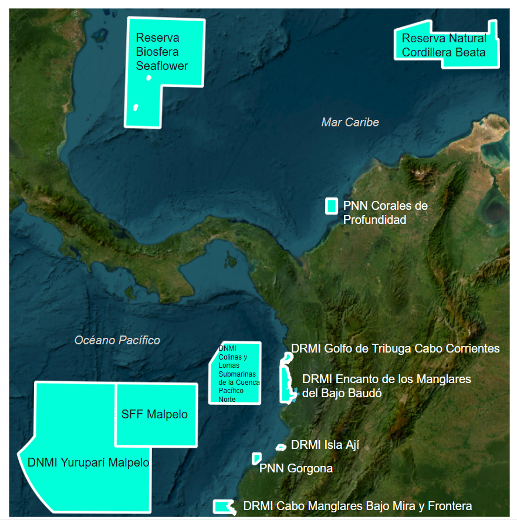
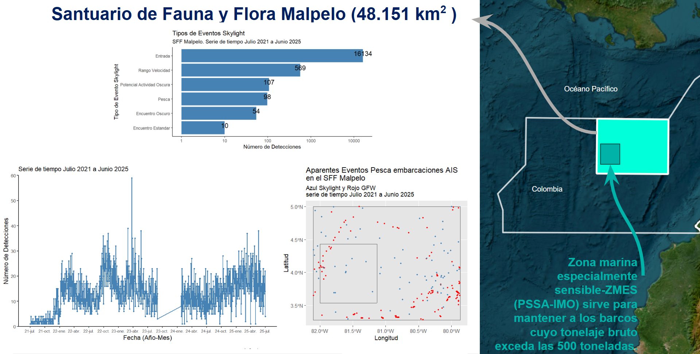
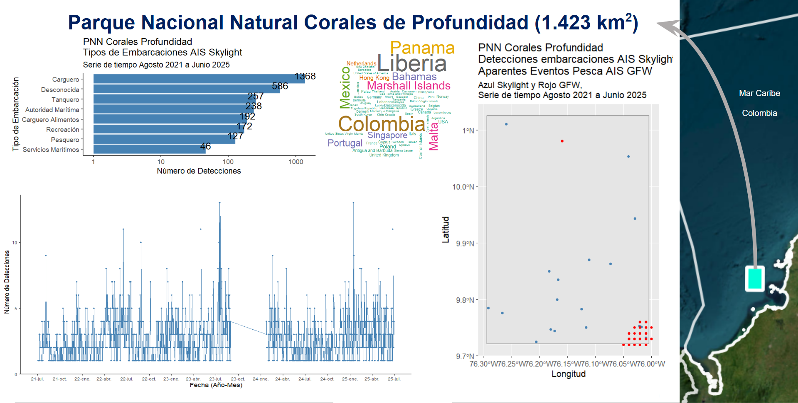

# Explorando-AMPs-de-Colombia
 
<!DOCTYPE html>
<html lang="es">
<head>
 <meta charset="UTF-8">
 <meta name="viewport" content="width=device-width, initial-scale=3.0">
 <link rel="stylesheet" href="styles.css"/>
</head>
<body>
    <header>
        <h1>Ejemplo: presencia de barcos pesqueros en Áreas Marinas Protegidas utilizando la información sobre AIS de Global Fishing Watch y Skylight</h1>
      
por: Christian Diaz 

    </header>
    <main>
        <section class="section" id="section1">
            <h2>Mapa general de algunas Áreas Marinas Protegidas AMP de Colombia</h2>
            
        </section>
        <section class="section" id="section2">
            <h2>Ejemplo de la presencia de barcos pesqueros en Área Marina Protegida Pacífico Colombia</h2>
            
        </section>
        <section class="section" id="section3">
            <h2>Ejemplo de la presencia de barcos pesqueros en Área Marina Protegida Caribe Colombia</h2>
            
        </section>
    </main>
</body>
</html>
